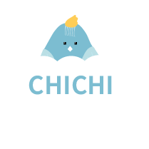

# 吱吱 CHICHI

## 簡介

CHICHI 是一個專為創作者和支持者打造的募資平台，致力於提供簡單、直觀且安全的使用體驗。

**為什麼是「吱吱」？**

我們的名字來自機器運轉的聲響，代表著希望與行動的能量。\
透過我們的平台，每一個小小的「吱吱」都將轉化為推動夢想的動力，引領創意實現的方向。

在這個節奏飛快的世界裡，夢想常常如微弱的聲音，被淹沒在人群中。\
而吱吱 CHICHI，是一個為夢想而生的募資平台，我們的目標是讓每一個人、每一個創意都有機會被傾聽、被支持。

  <a href="https://chichii.com/" target="_blank">專案網址</a>

  <a href="https://www.youtube.com/watch?v=GJHacNmD708" target="_blank">Demo 影片</a>

  <a href="https://www.youtube.com/watch?v=GJHacNmD708" target="_blank">簡報介紹</a>

## 網站大綱

CHICHI 是一個專為創作者和支持者打造的募資平台,致力於提供簡單、直觀且安全的使用體
驗。平台的設計採用現代化風格,無論是創作者發起項目,還是支持者瀏覽與贊助,都能快速
上手。透過 Google 第三方登入,用戶能夠輕鬆註冊並加入平台,而整合的綠界金流系統則讓
付款過程既便捷又安全。

網站的運行基於穩定可靠的技術架構,確保每個募資項目和用戶資料都受到妥善保護。平台還
提供即時通知和互動功能,讓支持者能第一時間掌握募資進展或與創作者交流。無論是透過手
機、平板還是電腦,CHICHI 都能為用戶帶來流暢的體驗。

憑藉強大的雲端部署技術,網站的穩定性和速度得以提升,服務全球用戶。無論是創作者尋求
支持,還是支持者助力夢想,CHICHI 都是最值得信賴的選擇。

## 功能簡介

1.  
2.  
3.  
4.  
5.  

## 使用技術

- **前端技術:** Tailwind CSS、daisyUI、Alpine.js、htmx
- **後端技術:** Python、Django
- **網站部署:** Zeabur
- **其他技術:**
  - **版本控管：** Git、GitHub
  - **郵件服務：** Mailgun
  - **資料庫：** MySQL
  - **文件儲存與管理：** AWS S3
  - **第三方登入：** Google
  - **第三方支付：** 綠界
  - **圖表分析：** Chart.js

## 安裝環境

1. poetry install
2. npm install
3. 建立.env

## 團隊成員

- 陳致宇[GitHub](https://github.com/minirov1208)
  - 贊助系統
  - 專案上下架功能
  - 收藏功能
  - 圖表分析
  - excel 輸出
- 楊奇恩[GitHub](https://github.com/IanYang1106)

  - 金流系統
  - 環境建置
  - 會員系統

- 劉奕伶[GitHub](https://github.com/lioouzzz)
  - 第三方登入
  - 按讚功能
  - 留言回覆功能
  - 日曆系統
- 張維心[GitHub](https://github.com/viviennehsin)
  - 分類系統
  - 權限功能
  - 搜尋功能
  - 建立 Command Line
  - Google map
- 王則勛[GitHub](https://github.com/JW-921)
  - 常見問題
  - 拖拉選單
  - 網站部署
  - Mailgun 串接
